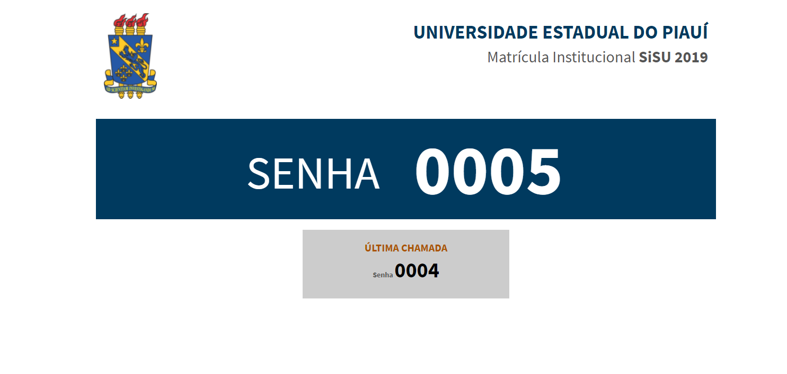

# SistemachamadordeSenhaJS
 Neste projeto criamos um sistema chamador de senha feito em js, ele foi destinado ao controle de filas de uma instituição de ensino e a alta demanda de alunos no periodo de matriculas do sisu fez-se necessário um sistema para controle. 
 

